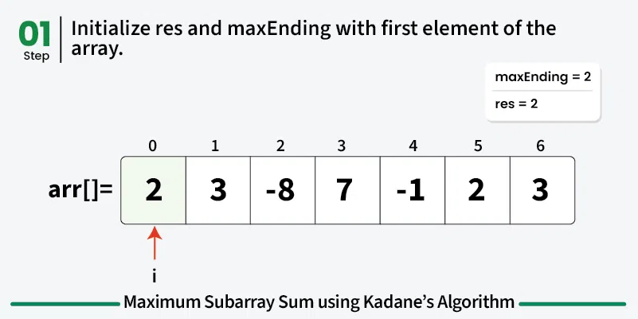
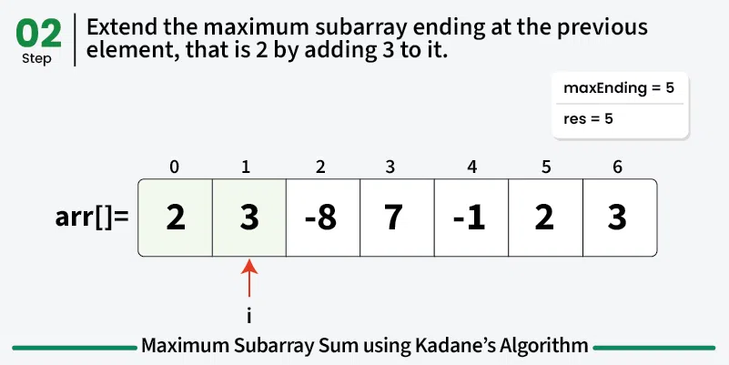
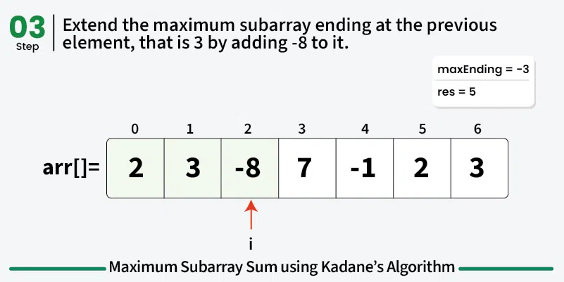
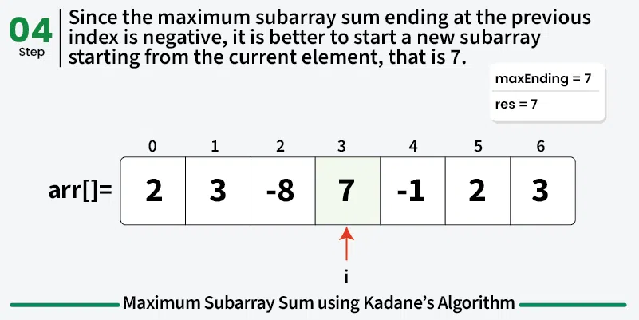
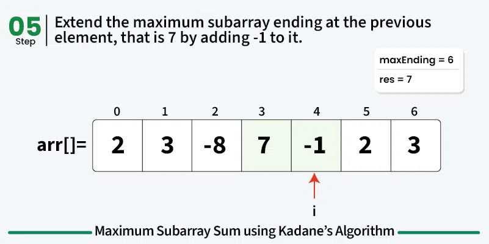

# Maximum Subarray Sum

## Explanation

Given an array **arr[]**, the task is to find the subarray that has the **maximum sum** and return its **sum**

## Examples ##

    Input: arr[] = {2, 3, -8, 7, -1, 2, 3}
    Output: 11
    Explanation: The subarray {7, -1, 2, 3} has the largest sum 11.

    Input: arr[] = {-2, -4}
    Output: –2
    Explanation: The subarray {-2} has the largest sum -2.

    Input: arr[] = {5, 4, 1, 7, 8}
    Output: 25
    Explanation: The subarray {5, 4, 1, 7, 8} has the largest sum 25.

## My First approach ##

The first array and second arrary hint me with the maximum number of the list
    
    Input: arr[] = {2, 3, -8, 7, -1, 2, 3} ### 7 is the maximum

    Input: arr[] = {-2, -4} ### -2 is the maximum

## Naive approach ##

### By iterating over all subarrays - O(n^2) Time and O(1) Space

The idea is to run two loops to iterate over all possible subarrays and find the maximum sum.

The **outer loop** will mark the *starting point* of a subarray and **inner loop** will mark the *ending point* of the subarray

    arr = [2, 3, -8, 7, 1, 2, 3]

    arr[0] = 2 is the starting point

The **outer loop** will go through the array

    [2, 3, -8, 7, 1, 2, 3]
    [3, -8, 7, 1, 2, 3]
    [-8, 7, 1, 2, 3]
    [7, 1, 2, 3]
    [1, 2, 3]
    [2, 3]
    [3]

The **inner loop** will go through the *current point* in **outer loop** until the *end point*

During the first inner loop:
    
    starting_point = 2
    [2, 3, -8, 7, 1, 2, 3]
    [2,
     [3, -8, 7, 1, 2, 3]
    ]
j = 1

array[1] = 3

max_sum = max_sum + array[1] -> 2 + 3 = 5

starting_point = starting_point < max_sum -> 2 < 5

    [2, 3,
     [-8, 7, 1, 2, 3]
    ]
j = 2

array[2] = -8

max_sum = max_sum + array[2] -> 5 + -8 = -3

starting_point = starting_point > max_sum -> 5 > -3

The *starting point* here is greater than *max_sum* then we go to the **second loop of the outerloop**

#  Kadane’s Algorithm – O(n) Time and O(1) Space ##

### The idea of Kadane’s algorithm is to traverse over the array from left to right and for each element, find the maximum sum among all subarrays ending at that element. The result will be the maximum of all these values. 

But, the main issue is how to calculate maximum sum among all the subarrays ending at an element in O(1) time?

To calculate the maximum sum of subarray ending at current element, say maxEnding, we can use the maximum sum ending at the previous element. So for any element, we have two choices:

*    ## Choice 1: ##
 Extend the maximum sum subarray ending at the previous element by adding the current element to it. If the maximum subarray sum ending at the previous index is positive, then it is always better to extend the subarray.

*    ## Choice 2: ##
Start a new subarray starting from the current element. If the maximum subarray sum ending at the previous index is negative, it is always better to start a new subarray from the current element.

**This means that maxEnding at index i = max(maxEnding at index (i – 1) + arr[i], arr[i]) and the maximum value of maxEnding at any index will be our answer.**

## STEPS

