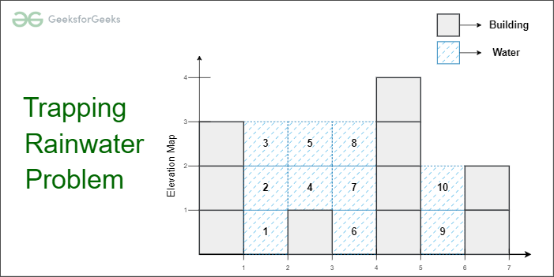

# Trapping Rain Water

## Explanation

Trapping Rainwater Problem states that given an array of ***n non-negative integers arr[]*** representing an elevation map where the width of each bar is 1, compute how much water it can trap after rain.

## Examples ##

    Input: arr[] = {3, 0, 1, 0, 4, 0, 2}
    Output: 10
    Explanation: The expected rainwater to be trapped is shown in the above image.

    Input: arr[]   = {3, 0, 2, 0, 4}
    Output: 7
    Explanation: We trap 0 + 3 + 1 + 3 + 0 = 7 units.

    Input: arr[] = {1, 2, 3, 4}
    Output: 0
    Explanation : We cannot trap water as there is no height bound on both sides

    Input: arr[] = {10, 9, 0, 5}
    Output: 5
    Explanation : We trap 0 + 0 + 5 + 0 = 5

## First approach

* An element of the array can store water if there are higher bars on the left and the right. 
* The amount of water to be stored in every position can be found by finding the heights of the higher bars on the left and right sides. 
* The total amount of water stored is the summation of the water stored in each index.
* No water can be filled if there is no boundary on both sides.

Traverse every array element and find the highest bars on the left and right sides. Take the smaller of two heights. The difference between the smaller height and the height of the current element is the amount of water that can be stored in this array element.